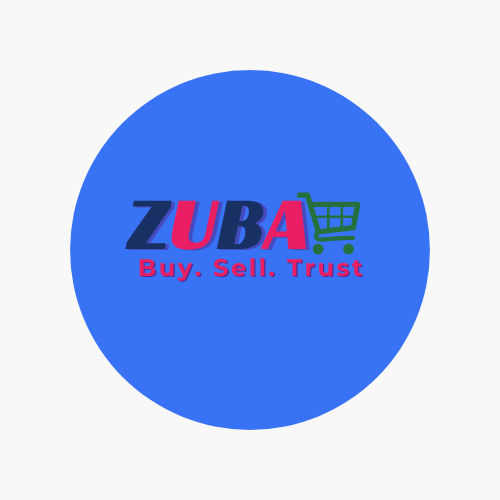

🚀 Zuba — Trusted Social Commerce Marketplace

Zuba is a Ghana-first social commerce platform designed for social media sellers.
It allows sellers to create online stores in minutes, manage products, orders, payments, deliveries, and receive secure payments through an escrow system.

Buyers can browse products across all stores in the Zuba Marketplace, make payments confidently, and enjoy a fraud-free buying experience.

📱 Core Features
For Sellers

-Create a store in under 5 minutes
-Add/edit/delete products with multiple images
-Manage orders in real-time
-Track delivery and payment statuses
-Secure payouts via bank or mobile money
-Store verification (Ghana Card + selfie)
-Escrow-protected payments
-Store analytics
-Shareable store link & product links
-Auto-sync to social media (coming soon)

For Buyers

-Browse the entire marketplace
-View store profiles and ratings
-Mobile money and card payments
-100% escrow protection
-Confirm delivery before funds are released
-Rate and review products
-Chat with sellers in real time (Socket.IO)

Marketplace

-Multi-seller cart
-Single checkout session for all items
-Split orders by seller automatically
-Escrow held per seller
-Auto/manual release of funds
-Seller payout after buyer confirms

🛠️ Tech Stack
-Frontend (Mobile App)
-React Native
-TypeScript
-Zustand
-React Navigation
-Tailwind/Daisy UI (NativeWind)

Backend
-Node.js (ESM)
-Express.js
-Prisma ORM
-PostgreSQL
-Redis (caching + rate limiting)
-Socket.IO (real-time chat + notifications)

Payments

-Flutterwave (Escrow, Split Payments, Transfers)
-Paystack (Optional)
-Storage

Cloudinary (images)

🔐 Security & Compliance

-JWT authentication
-Rate limiting
-Store + Seller identity verification
-Ghana Card OCR + Face Match
-Phone number OTP
-Data validation (Zod)
-Secure payouts only to verified sellers

🧩 System Architecture
1. Authentication
-Signup with email + phone
-OTP verification
-Refresh/Access token rotation
-Password reset flow

2. Seller Verification Flow
-Upload Ghana Card
-OCR extracts: name, DOB, ID number
-User inputs validated
-Upload selfie
-Face match
-Verified badge applied

3. Escrow Payment Flow
-Buyer checks out
-Payment captured → Escrow wallet
-Order created for each seller
-Seller ships order
-Buyer confirms delivery
-Escrow releases funds → Seller payout account

4. Real-time Chat
-Socket.IO rooms per conversation
-Message read receipts
-Image/file sharing
-Online user tracking

🛣️ Roadmap

-Web dashboard for sellers
-AI pricing recommendations
-AI fraud detection
-Delivery partner integration
-In-app ads for sellers
-Loyalty system for buyers
-Voice note chat support

🤝 Contributing

Contributions are welcome!
Please open an issue or submit a pull request.

🌍 About Zuba

Zuba was born from a real experience of lack of trust in social commerce.
Thousands of people sell on WhatsApp, TikTok, and Facebook — but buyers don’t always trust sellers, and sellers fear delivering items without payment.

Zuba solves this with a trusted escrow marketplace, enabling safe buying and selling for everyone.
